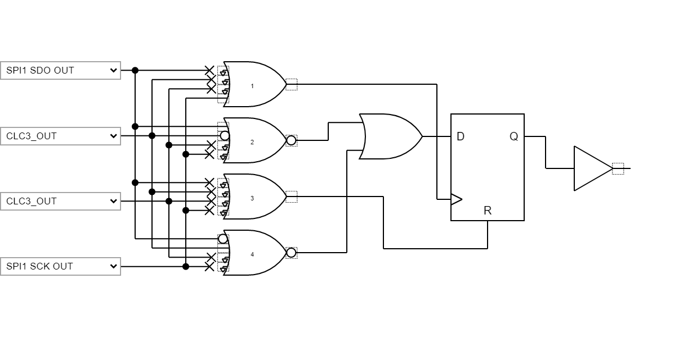
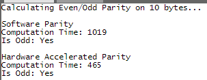

<!-- Please do not change this logo with link -->

# HW Parity Calculation with SPI/MSSP and CLC on PIC16F18146

A parity bit is a simple way to protect a chunk of data against single bit transmit errors. The parity bit is used to ensure the number of ones present in the stream is even or odd (dependent on the receiver). The parity bit is then checked to verify that the number of ones present in the data is as expected. If it is not, then a single bit error has occurred during transmission and the data is considered to be corrupted. Calculating this in software is straightforward, but is a slow process. Instead, a Host Synchronous Serial Port Module (MSSP) peripheral paired with a Configurable Logic Cell (CLC) can be used to significantly accelerate the calculation. This program will measure this time difference and print it to a serial terminal for comparison. 

## Software Used  
- [MPLAB® X IDE 6.0.5 or newer](https://www.microchip.com/en-us/tools-resources/develop/mplab-x-ide?utm_source=GitHub&utm_medium=&utm_campaign=MCU8_MMTCha_pic181xx&utm_content=pic16f18146-hw-parity-mplab-mcc-github)
- [MPLAB XC8 2.41.0 or newer compiler](https://www.microchip.com/en-us/tools-resources/develop/mplab-xc-compilers?utm_source=GitHub&utm_medium=&utm_campaign=MCU8_MMTCha_pic181xx&utm_content=pic16f18146-hw-parity-mplab-mcc-github)
- [MPLAB Code Configurator (MCC)](https://www.microchip.com/en-us/tools-resources/configure/mplab-code-configurator?utm_source=GitHub&utm_medium=&utm_campaign=MCU8_MMTCha_pic181xx&utm_content=pic16f18146-hw-parity-mplab-mcc-github)
- [MPLAB Data Visualizer](https://www.microchip.com/en-us/tools-resources/debug/mplab-data-visualizer?utm_source=GitHub&utm_medium=&utm_campaign=MCU8_MMTCha_pic181xx&utm_content=pic16f18146-hw-parity-mplab-mcc-github) or other serial terminal

## Hardware Used

- [Curosity Development Board (DM164137)](https://www.microchip.com/en-us/development-tool/DM164137?utm_source=GitHub&utm_medium=&utm_campaign=MCU8_MMTCha_pic181xx&utm_content=pic16f18146-hw-parity-mplab-mcc-github)
- [PIC16F18146 DIP](https://www.microchip.com/en-us/product/PIC16F18146?utm_source=GitHub&utm_medium=&utm_campaign=MCU8_MMTCha_pic181xx&utm_content=pic16f18146-hw-parity-mplab-mcc-github)  

*Note: Also compatiable with the [PIC16F17146 Curiosity Nano](https://www.microchip.com/en-us/development-tool/EV72J15A?utm_source=GitHub&utm_medium=&utm_campaign=MCU8_MMTCha_pic181xx&utm_content=pic16f18146-hw-parity-mplab-mcc-github). To use this board, change the device target to PIC16F17146 in the project properties. No other changes are needed.*

## Setup

### UART Settings

Baud Rate: 9600  
Char Length: 8 bits  
Parity: None  
Stop Bits: 1 bit  

### I/O Configuration

For the Curiosity Development Board, connect RB5 and RB7 to the UART RX and TX header with jumper wire. 

| Pin | Description
| --- | ----------
| RC0 | SW0 Input (Curiosity Nano Only)
| RB5 | UART RX
| RB7 | UART TX
| RC1 | LED0 (Curiosity Nano Only)  

## Implementation  

### Hardware Setup

To implement the parity checker in hardware, a CLC and an MSSP (or SPI) peripheral are required. If the project already uses an MSSP or SPI peripheral, the same instance can be reused.  

The CLC is setup to XOR the bit stream from the MSSP, with the last logic value latched. In practice, the CLC is setup as a 2-input D Flip-Flop with Reset. The logic gates are configured to implement the XOR, as shown below.

*Note: This assumes data is valid on the rising edge of the serial clock. If data is valid on the falling (negative) edge, invert the clock signal within the CLC.*  

This implementation generates an even parity, or in other words, a "1" when an odd number of ones have been seen.  

### Software Setup
Since this implementation doesn't use the reset, it is necessary to first store the output state of the CLC before loading data. Then, use the SPI driver to transmit data.  

*Note: If the SPI bus is used for communication, be sure to deassert the Chip Select (CS) and Serial Select (SS) lines when performing this operation.*  

When the data transmission is complete, read the output state of the CLC. If the new output matches the original output, an even number of ones have been seen. If they mismatch, then an odd number of ones have been seen.  

## Evaluating the Performance
On startup, the system computes the parity using a hard-coded set of constants. While parity is being calculated, Timer 1 is used to measure how many clock cycles (Fosc/4) it takes to execute. A sample output is shown below.

  

*Note: The execution time is dependent on the optimization level of the compiler. The Free project configuration runs at level 0, with no optimizations, whereas Pro runs at level S. If you do not have a Pro compiler license, the compiler will automatically switch to level 2 optimizations.*

If you are using a PIC16F17146 Curiosity Nano, pressing SW0 (on RC0) will rerun the calculation. If you are on the Curiosity Development Board, pressing the Reset button will reset the microcontroller and rerun the test. 

## Modifying the Data Stream
Out of the box, this example performs the parity calculation on 10 values:  
  
 0, 1, 2, 3, 4, 5, 6, 7, 8, 9  
   
But, this can be changed, if desired. The macro `DATA_ARRAY_SIZE` defines how much memory is allocated for the constants. `DATA_SCAN_LENGTH` sets how many constants are scanned during the test. Finally, the variable `data[DATA_ARRAY_SIZE]` contains the data to scan.

All of these are located in `main.c`.

## Other Compatiable Devices
The same CLC implementation can be used with other peripherals as well. Standalone SPI modules can be used to send data into the CLC. The SR Port peripheral can also be used as a shifter.  

## Summary
This example has shown how to use a CLC with an MSSP/SPI to accelerate parity calculations. 